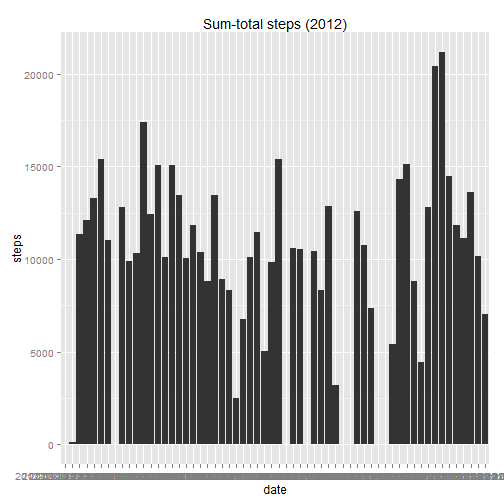
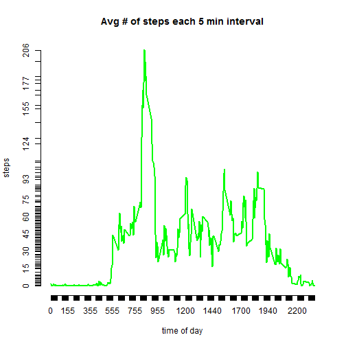

# 0. Task: some prerequisites here (loading libraries, setting options, etc)

```r
library(knitr)
library(lubridate)
#library(stringr)
library(ggplot2)
library(markdown)
library(timeDate)
library(timeSeries)
#library(zoo)
#library(useful)
# rpubsUpload(title, htmlFile, id = NULL, properties = list(), method = getOption("rpubs.upload.method", "internal"))
opts_chunk$set(fig.path = "./figures/") # Set figures path
opts_chunk$set(scipen=1,digits=4) #just a hint from the forum
set.seed(503) #just in case! for reproducibility
# Sys.setlocale("LC_ALL", "en")
```
  

# 1. Task: Loading and preprocessing the data (incl. visual inspection)

```r
my_data<-read.csv("activity.csv",header=TRUE)   
head(my_data)
```

```
##   steps       date interval
## 1    NA 2012-10-01        0
## 2    NA 2012-10-01        5
## 3    NA 2012-10-01       10
## 4    NA 2012-10-01       15
## 5    NA 2012-10-01       20
## 6    NA 2012-10-01       25
```

```r
tail(my_data)
```

```
##       steps       date interval
## 17563    NA 2012-11-30     2330
## 17564    NA 2012-11-30     2335
## 17565    NA 2012-11-30     2340
## 17566    NA 2012-11-30     2345
## 17567    NA 2012-11-30     2350
## 17568    NA 2012-11-30     2355
```

```r
# here is preprocessing: merge date and interval (military-time) together in POSIXct, then convert to timeseries
my_data$interval_sec<-((my_data$interval %/% 100) * 3600) + ((my_data$interval %% 100) *60)
my_data$date<-as.POSIXct(my_data$date)
my_data$date_total<-my_data$date + my_data$interval_sec
my_data_p<-my_data[,c(2,1,5)]
my_ts<-as.timeSeries(my_data_p)
```
  

# 2. Task: Sumplot + Median/Mean total Number of steps taken per day, -ignoring NAs

```r
my_by<-timeSequence(from=start(my_ts), to=end(my_ts),by="day")
my_agg<-aggregate(my_ts, my_by, sum)
my_agg_m<-as.matrix(my_agg)
my_agg_df<-as.data.frame(my_agg_m)
my_agg_df$date<-rownames(my_agg_df)
qplot(x=my_agg_df$date, y=my_agg_df$steps, geom="bar", stat="identity", xlab="date", ylab="steps", main="Sum-total steps (2012)") #only lacks rotation of x-ticks... with ggplot2 it would be possible http://www.cookbook-r.com/Graphs/Axes_(ggplot2)/
```

```
## Warning: Removed 7 rows containing missing values (position_stack).
```

 

```r
# timeSeries::plot(my_agg$steps, type="h",col="steelblue",main="SUM-TOTAL of steps per day",xlab="date",ylab="steps") #this is just another try for plotting
my_mean<-sum(my_agg_df$steps,na.rm=T)/nrow(my_agg_df)
# I did not opt for mean(my_agg_df$steps,na.rm=T)  as this was heavily discussed in the forum!
my_median<-median(my_agg_df$steps,na.rm=T)
```

The mean total number of steps taken per day amounts to 9510.1333333 steps.  
The median total number of steps taken per day amounts to 10765 steps.

  
# 3. Task: Finding the average daily activity pattern

```r
my_daily_act<-aggregate(steps ~ interval, data=my_data, mean)
my_daily_act$interval<-as.character.Date(my_daily_act$interval)
plot(my_daily_act$interval, my_daily_act$steps, type="l", xlab= "time of day", ylab= "steps", col="green" , lwd=2, axes=F)
axis(side=1, at=my_daily_act$interval)
axis(side=2, at=round(my_daily_act$steps,0))
title("Avg # of steps each 5 min interval")
```

 

```r
my_max_act_time <- my_daily_act[my_daily_act$steps == max(my_daily_act$steps), 1]
my_max_act_steps <- my_daily_act[my_daily_act$steps == max(my_daily_act$steps), 2]
```

The most active 5-minute period starts at  835 o'clock with 206.1698113 steps (on average).


# 4. Task: Imputation (for missing NA values)
